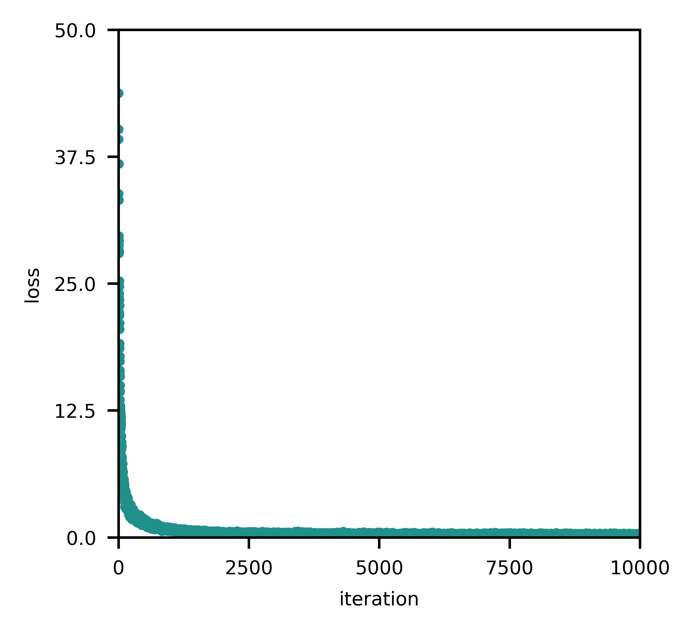
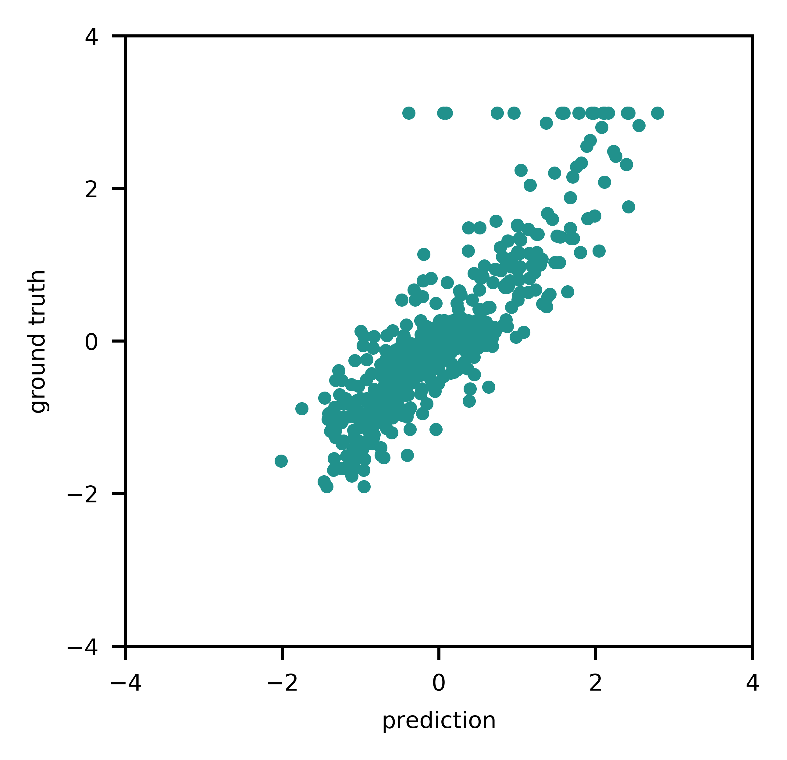

# metas-learn
Collection of machine learning algorithms implemented in Python as part of an Innosuisse project (36779.1 IP-ENG), read more about it here: https://www.aramis.admin.ch/Grunddaten/?ProjectID=44523.

## Example

### Load libraries.
	from NeuralNetworkRegressor import NeuralNetworkRegressor
	import numpy as np
	from sklearn.datasets import load_boston
  	from sklearn.preprocessing import StandardScaler
	import matplotlib.pyplot as plt
  
### Load data.
As a guidline, it is recommended to scale data before training, e.g. using a standard scaling (zero mean, unit variance).

  	scaler = StandardScaler()
  	X, y = load_boston(return_X_y=True)
  	X, y = scaler.fit_transform(X), scaler.fit_transform(y.reshape(-1, 1))
  	nnr = NeuralNetworkRegressor(hidden_layer_sizes=(10,), alpha=1.0)
  
### Fit model.
	nnr.fit(X, y)
	y_pred = nnr.predict(X)
	
### Evaluate model.

	fig = plt.figure(figsize=(2.95,2.95))
	ax = fig.add_subplot(111)
	ax.plot(np.arange(1, len(nnr.loss)+1), nnr.loss, ".", ms=4, color=plt.cm.viridis(0.5), alpha=1.0)
	ax.set_xlabel('iteration')
	ax.set_ylabel('loss')
	ax.set_xlim(1e-1, 1e4)
	ax.set_ylim(0, 50)
	ax.set_xticks(np.round(np.linspace(0,1e4,5),2))
	ax.set_yticks(np.round(np.linspace(0,50,5),2))
	plt.show()
	

	fig = plt.figure(figsize=(2.95,2.95))
	ax = fig.add_subplot(111)
	ax.scatter(y_pred, y, color=plt.cm.viridis(0.5), s=6, alpha=1.0)
	ax.set_xlim(-4, 4)
	ax.set_ylim(-4, 4)
	ax.set_xlabel('prediction')
	ax.set_ylabel('ground truth')
	ax.set_xticks(np.round(np.linspace(-4,4,5),2))
	ax.set_yticks(np.round(np.linspace(-4,4,5),2))
	plt.show()
	

