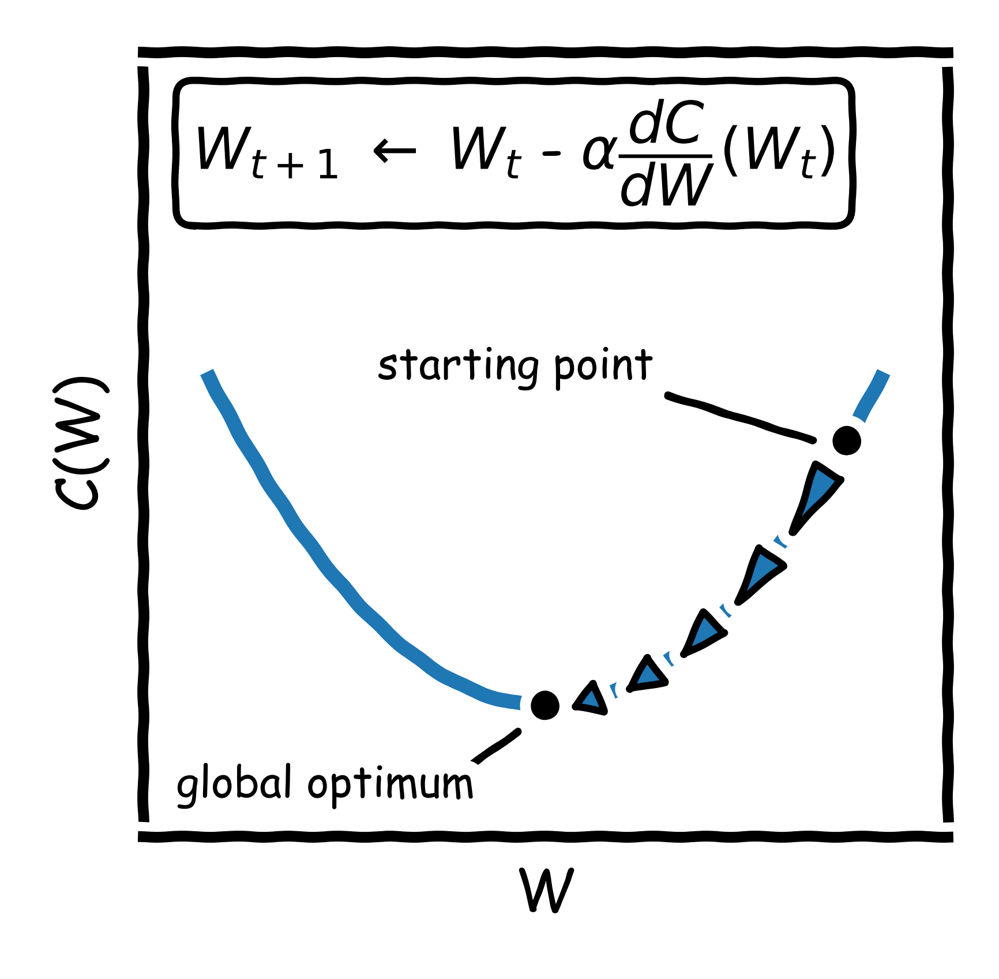
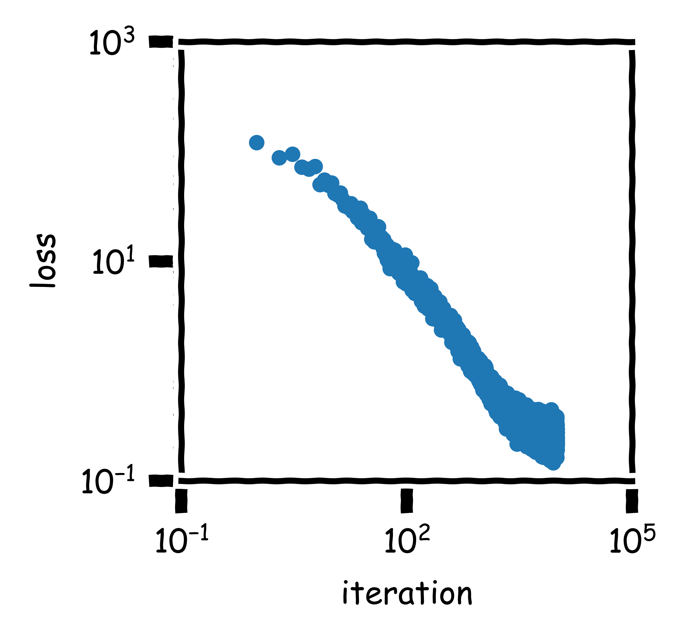
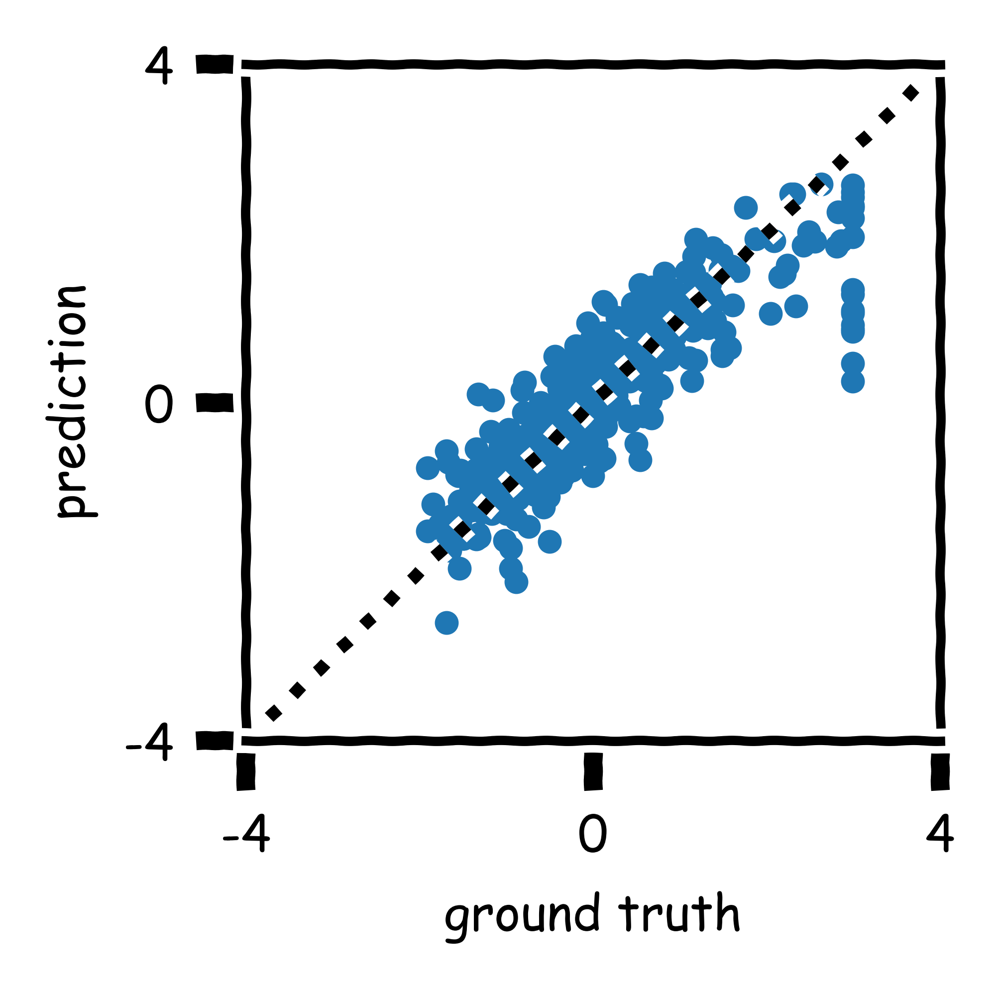
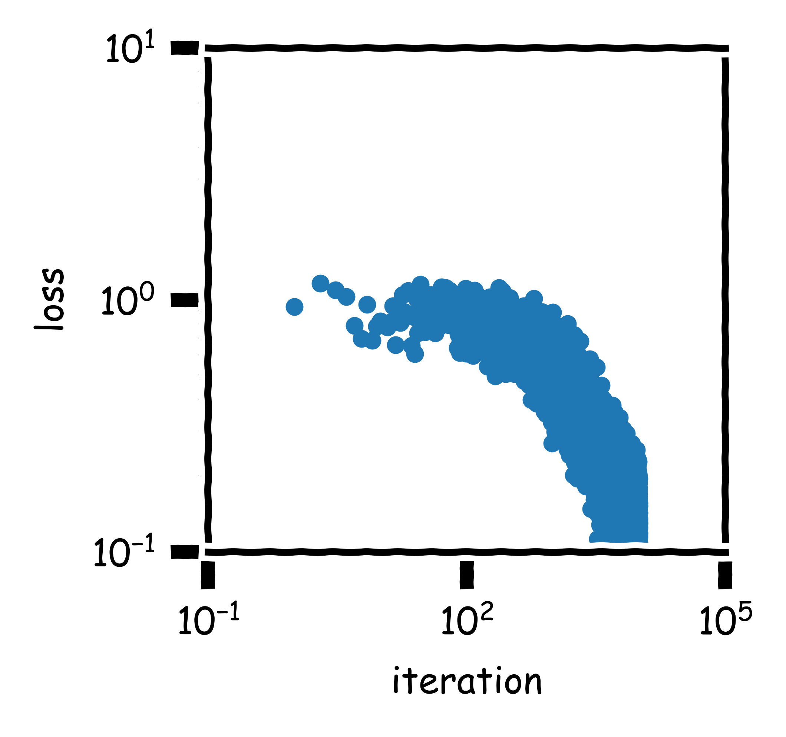

# metas-learn
Collection of machine learning algorithms implemented in Python as part of a project funded by the Swiss Innovation Agency (36779.1 IP-ENG), read more about it here: https://www.aramis.admin.ch/Grunddaten/?ProjectID=44523.
The algorithms have been implemented as standalone classes; this leads to redundancy and more code because the same functions are present in several files, but it easier to modify or implement them as part of A.I. solutions.

The regression and classification algorithms are based on **stochastic gradient descent** (and the clustering algorithm is based on expectation-maximization). Gradient descent is a first-order iterative optimization algorithm for finding a local minimum of a differentiable function. Gradient descent is based on the observation that if the multi-variable function C(W) is defined and differentiable in a neighborhood of a point W, then C(W) decreases fastest if one goes from W in the direction of the negative gradient of C at W, -dC(W)/dW. 

However, by including only a randomly selected subset of data in the computation of the gradient, the algorithm becomes stochastic since it replaces the actual gradient (calculated from the entire data set) by an estimate thereof (calculated from a randomly selected subset of the data).

## Examples

### Regression

#### Load libraries.
  	from StandardScaler import StandardScaler
	from NeuralNetworkRegressor import NeuralNetworkRegressor
	import numpy as np
	from sklearn.datasets import load_boston
	import matplotlib.pyplot as plt
  
#### Load data.
As a guidline, it is recommended to scale data before training, e.g. using a standard scaling (zero mean, unit variance).

  	scaler = StandardScaler()
  	X, y = load_boston(return_X_y=True)
  	X, y = scaler.fit_transform(X), scaler.fit_transform(y.reshape(-1, 1))
  	nnr = NeuralNetworkRegressor(hidden_layer_sizes=(10,), alpha=1.0)
  
#### Fit model.
	nnr.fit(X, y)
	y_pred = nnr.predict(X)
	
#### Evaluate model.

##### Learning Curve

	with plt.xkcd():
	    fig = plt.figure(figsize=(2.00, 2.00))
	    ax = fig.add_subplot(111)
	    ax.scatter(np.arange(1, len(nnr.loss)+1), np.array(nnr.loss).flatten(), s=8)
	    ax.set_xlabel("iteration")
	    ax.set_ylabel("loss")
	    ax.set_xscale("log")
	    ax.set_yscale("log")
	    ax.set_xlim(1e-1, 1e5)
	    ax.set_ylim(1e-1, 1e3)
	    ax.set_xticks((1e-1, 1e1, 1e3, 1e5))
	    ax.set_yticks((1e-1, 1e0, 1e1, 1e2, 1e3))
	    plt.show()
	

##### Agreement

	with plt.xkcd():
	    fig = plt.figure(figsize=(2.00, 2.00))
	    ax = fig.add_subplot(111)
	    ax.plot([-4, 4], [-4, 4], ":", color="k", alpha=1.0)
	    ax.scatter(y, y_pred, s=8, alpha=1.0)
	    ax.set_xlim(-4, 4)
	    ax.set_ylim(-4, 4)
	    ax.set_xlabel("ground truth")
	    ax.set_ylabel("prediction")
	    ax.set_xticks(np.round(np.linspace(-4, 4, 5), 2))
	    ax.set_yticks(np.round(np.linspace(-4, 4, 5), 2))
	    plt.show()
	

### Classification

#### Load libraries.
  	from StandardScaler import StandardScaler
	from LogisticClassifier import LogisticClassifier
	from sklearn.metrics import roc_curve
	import numpy as np
	from sklearn.datasets import load_breast_cancer
	import matplotlib.pyplot as plt
  
#### Load data.
As a guidline, it is recommended to scale data before training, e.g. using a standard scaling (zero mean, unit variance).

  	scaler = StandardScaler()
  	X, y = load_breast_cancer(return_X_y=True)
  	X = scaler.fit_transform(X)
  	lc = LogisticClassifier(alpha=1.0)
  
#### Fit model.
	lc.fit(X, y)
	y_pred = lc.predict(X)
	
#### Evaluate model.

##### Learning Curve
	with plt.xkcd():
	    fig = plt.figure(figsize=(2.00, 2.00))
	    ax = fig.add_subplot(111)
	    ax.scatter(np.arange(1, len(lc.loss)+1), np.array(lc.loss).flatten(), s=8)
	    ax.set_xlabel("iteration")
	    ax.set_ylabel("loss")
	    ax.set_xscale("log")
	    ax.set_yscale("log")
	    ax.set_xlim(1e-1, 1e5)
	    ax.set_ylim(1e-1, 1e1)
	    ax.set_xticks((1e-1, 1e1, 1e3, 1e5))
	    ax.set_yticks((1e-1, 1e0, 1e1))
	    plt.show()
	

##### Receiver Operating Characteristic (ROC)
	fpr, tpr, thresholds = roc_curve(y, y_pred, pos_label=1)
	with plt.xkcd():
	    fig = plt.figure(figsize=(2.00, 2.00))
	    ax = fig.add_subplot(111)
	    ax.plot(fpr, tpr, "-")
	    ax.plot([-4, 4], [-4, 4], ":", color="k", alpha=1.0)
	    ax.set_xlabel("false positive rate")
	    ax.set_ylabel("true positive rate")
	    ax.set_xlim(-0.035, 1.035)
	    ax.set_ylim(-0.035, 1.035)
	    ax.set_xticks((0, 0.5, 1))
	    ax.set_yticks((0, 0.5, 1))
	    plt.show()
	    

